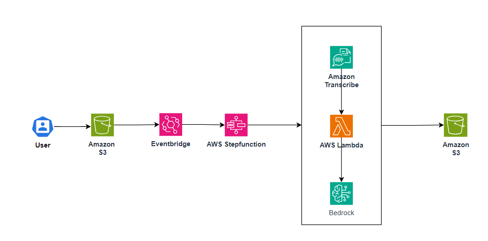

# Analyzing audio recordings and summarize key discussions and action items

The purpose of this repo is to provide an automated, scalable, and cost-effective solution for processing audio recordings, transcribing spoken words into text, and summarizing key discussions and action items within the transcription. This pattern is particularly suited for organizations looking to automate scenarios where insights from audio recordings are critical, without the efforts of maintaining infrastructure. This solution includes:

**Audio Transcription:** Audio files recorded and uploaded to an S3 bucket trigger an AWS Step Functions state machine. The state machine coordinates with AWS Transcribe to convert the audio into a written transcript, making the content easily searchable and analyzable.

**Speaker Identification:** Once transcribed, a Lambda function is used to parse the transcription and perform speaker identification

**Bedrock Summarization:** The pattern includes mechanisms to summarize the key discussions and action items within the audio. 

*Important:* this application uses various AWS services and there are costs associated with these services after the Free Tier usage - please see the [AWS Pricing page](https://aws.amazon.com/pricing/) for details. You are responsible for any AWS costs incurred. No warranty is implied in this example.

## Requirements

* [Create an AWS account](https://portal.aws.amazon.com/gp/aws/developer/registration/index.html) if you do not already have one and log in. The IAM user that you use must have sufficient permissions to make necessary AWS service calls and manage AWS resources.
* [AWS CLI](https://docs.aws.amazon.com/cli/latest/userguide/install-cliv2.html) installed and configured
* [Git Installed](https://git-scm.com/book/en/v2/Getting-Started-Installing-Git)
* [AWS Serverless Application Model](https://docs.aws.amazon.com/serverless-application-model/latest/developerguide/serverless-sam-cli-install.html) (AWS SAM) installed

## Deployment Instructions

1. Create a new directory, navigate to that directory in a terminal and clone the GitHub repository:
    
    ``` 
    git clone https://github.com/aws-samples/serverless-patterns
    ```
2. Navigate to the directory where your SAM application is located. 

    ```
    cd <SAM-directory>
    sam validate 
    ```
3. Now, build the artifacts using SAM to package the deployment

    ```
    sam build
    ```

4. Run through the guided deployment by running

    ```
    sam deploy --guided 

    ```
During the prompts:

    * Enter a stack name
    * Enter the desired AWS Region
    * Allow SAM CLI to create IAM roles with the required permissions.

Once you have run `sam deploy --guided` mode once and saved arguments to a configuration file (samconfig.toml), you can use `sam deploy` in future to use these defaults.

5. Note the outputs from the SAM deployment process. These contain the resource names and/or ARNs which are used for testing.

## Permissions

Once deployed it creates the following permissions:

**S3 Permissions**:
- `s3:GetObject`
- `s3:PutObject`
- `s3:ListBucket`

**Transcribe Permissions**:
- `transcribe:StartTranscriptionJob`
- `transcribe:GetTranscriptionJob`

**Bedrock Permissions**:
- `bedrock:InvokeModel`

**Lambda Permissions**:
- Invoke `SpeakerIdentificationFunction`
- Invoke `BedrockSummaryFunction`

**CloudWatch Permissions**:
- `cloudwatch:PutMetricData`

## How it works



The SAM defines these AWS resources as part of the stack: 

*VoiceProcessingStateMachine:* Defines an AWS Step Function State Machine resource that is triggered by new objects created in an S3 bucket. 

*S3HostingBucket:* S3 bucket that hosts the audio file. It is also set up to send event notifications to EventBridge. 

*S3OutputBucket:* Another S3 bucket to store the transcription and summarization output. 

## Testing

Provide steps to trigger the integration and show what should be observed if successful.

*Prerequisites:* Ensure the AWS SAM application is deployed to your AWS Account. 

1. Generate Audio file via Polly 
    ``` aws polly synthesize-speech --output-format mp3 --voice-id <VoiceId> --text "<put your text here>" output.mp3 ```

2. Copy audio file to S3 and trigger SFn 
    ```aws s3 cp <replace_with_your_output_mp3> s3://<replace_with_your_s3_bucket_name_from_sam_output>```

3. Check for step function execution 
    ```aws stepfunctions list-executions --state-machine-arn <replace_with_your_state_machine_arn_from_sam_output>```

4. Check for summarization and transcription output in S3 output bucket. 
    ```aws s3 ls s3://<replace_with_your_s3_output_bucket_name_from_sam_output>```


## Cleanup
 
1. Delete the S3 files in the hosting and output buckets above.

2. Delete the stack, via SAM
    ```
    sam delete
    ```
3. Confirm the stack has been deleted
    ```bash
    aws cloudformation list-stacks --query "StackSummaries[?contains(StackName,'STACK_NAME')].StackStatus"
    ```
    
----
Copyright 2023 Amazon.com, Inc. or its affiliates. All Rights Reserved.

SPDX-License-Identifier: MIT-0
